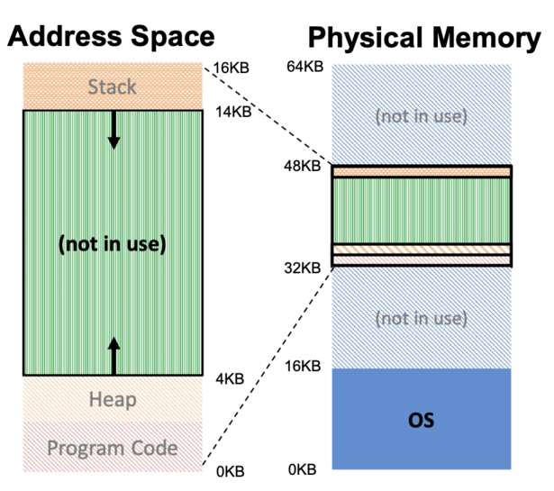

### 1. 도입 배경

단순 메모리 관리 기법 : 가상주소공간 전체를 물리메모리에 탑재하면서 비효율 문제



- 가상 주소 공간에서 Stack과 Heap 사이 사용하지 않는 공간이 할당되어 비효율성
- 가상주소공간이 물리메모리보다 큰 경우는 실행이 어려움
- 프로그램의 논리적 구조(Code, Data, Stack, Heap)를 메모리에 직접 반영하지 못함

### 2. Segmentation

가상 주소 공간을 논리적 단위인 세그먼트로 나누어 각각을 실제 메모리 주소 공간에 독립적으로 할당


- 사용하지 않는 공간에 대한 비효율 해결
- 프로그램의 논리적인 단위에 따라 일반적으로 Code, Stack, Heap으로 세그먼트를 나눔

### 3. Segment table

1. 프로그램이 논리적주소를 통해서 세그먼트에 접근
    
    `가상주소(논리적주소) = segment id + offset`
    
    - setment id  : 프로그램이 접근하려는 세그먼트를 식별
    - offset  : 그 세그먼트 내에서 특정 위치를 지정
2. 세그먼트 테이블을 참조해서 논리적주소를 물리적 주소로 변환
    
    `세그먼트 테이블 = segment id (인덱스) + limit (크기) + base address (시작주소) + ...`  
    


### 4. 주소 계산


1. 논리주소 첫 4비트인 `segment id` 를 인덱스로 세그먼트 테이블에 접근
2. 논리주소의  `offset`과 테이블 내 해당 세그먼트의 `limit`을 비교
    - offset이 limit보다 크다면 해당 세그먼트의 범위를 벗어나 접근하게 되어 **semgmentation fault** 에러 발생, 프로세스 강제 종료
3. 물리주소 = 테이블의 `base address` + 논리주소 `offset` 

```csharp
  base =    0010 0000 0010 0000
+ offset =       0010 1111 0000
물리주소 = 0010 0011 0001 0000
```

- Stack의 경우
    
    Stack은 거꾸로 확장되기 때문에 Stack 세그먼트의 base는 가장 높은 주소를 가짐
    
    따라서, `Stack의 물리주소 = base - offset`
    
- 세그먼트 테이블에는 `확장방향(0,1)` 필드도 포함

### 5. 프로세스 간 메모리 공유

세그멘테이션에서는 하나의 세그먼트를 여러 프로세스가 공유할 수 있음

- 여러 프로세스의 각각의 세그먼트 테이블이 공유하고자하는 세그먼트를 동일한 논리적 주소로 저장
- 같은 위치의 세그먼트를 가리킬 수 있음
- 세그먼트 테이블에는 `보호비트(r, w, x)` 설정도 포함 : 프로세스마다 다른 접근 권한을 부여

ex> 여러 프로세스가 동일한 라이브러리 코드를 참조할 때, 하나의 세그먼트를 공유하여 메모리 자원을 절약. 읽기 전용으로 설정해 코드에 대한 무단 수정도 방지


### 6. 문제점

1. 문맥 교환 시 복잡성 증가 : 
    
    프로세스테이블 뿐만 아니라 세그멘트 테이블에도 상태를 저장, 복원해야함
    
    - 관리해야할 데이터가 많아짐
    - 오버헤드 증가
2. 외부단편화 : 
    
    **메모리 공간이 여러 개의 작은 빈 공간**으로 나뉘어져 있을 때,  전체 빈 메모리 공간은 충분하지만, ****필요한 크기의 **연속된 메모리 블록을 할당할 수 없는** 상황. 이로 인해 프로그램이 요구하는 메모리 공간을 할당하지 못하게 됨
    
    ```csharp
    > 프로그램 A가 100MB 메모리를 요청하여 연속된 100MB를 할당받는다.
    > 이후 프로그램 B가 200MB 메모리를 요청하여 연속된 200MB를 할당받는다. 
    > 프로그램 A가 종료되면 100MB의 빈 공간이 남는다. 
    > 프로그램 C가 150MB 메모리를 요청하면, 비록 100MB 크기의 빈 공간이 남아있지만, 연속된 공간이 아니므로 그 빈 공간을 사용할 수 없음!
    ```
    

- 해결방법
    
    (1) 압축 : 메모리 내의 빈 공간을 한 곳으로 모아 연속적인 빈 공간을 확보
    
    - 메모리 블록을 이동하는 과정에서 **큰 비용**이 소요
    
    (2) 페이징 : 메모리를 일정한 크기의 작은 페이지로 나누어 관리
    
    - 프로그램이 요구하는 메모리를 페이지의 작은 단위로 나누고, 연속적이지 않은 물리메모리의 페이지를 할당함
    - 내부단편화 문제

<br>

---

### 면접 예상 질문

- 세그멘테이션이란 무엇이며, 이 방식의 장점은 무엇인가요?
- 세그멘테이션의 문제점은 무엇이며, 이를 해결할 수 있는 방법에는 어떤 것이 있나요?
- 세그멘테이션 방식에서 주소 변환은 어떻게 이루어지나요?

<br>

### 참고자료

https://m.blog.naver.com/kgr2626/222146539396

https://blog.naver.com/tlsrka649/222143909888

https://devfancy.github.io/OS-16-Segmentation/
